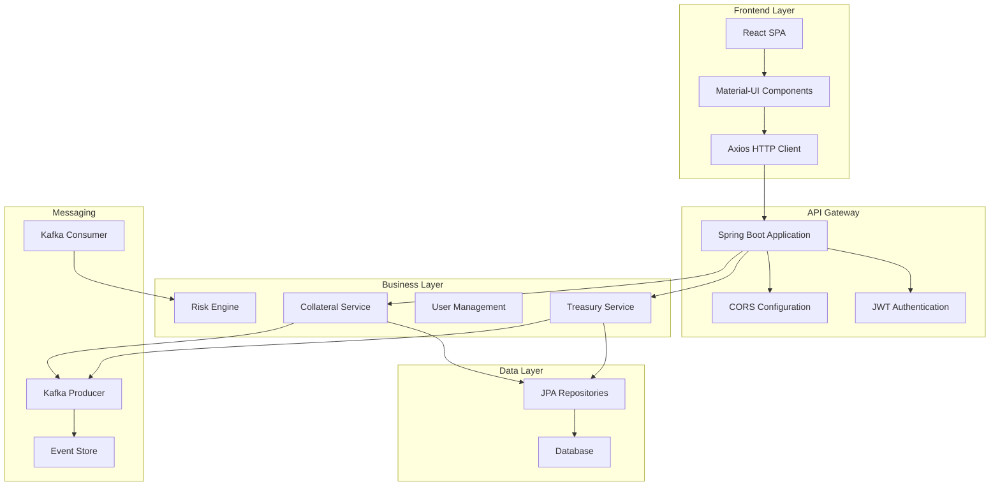
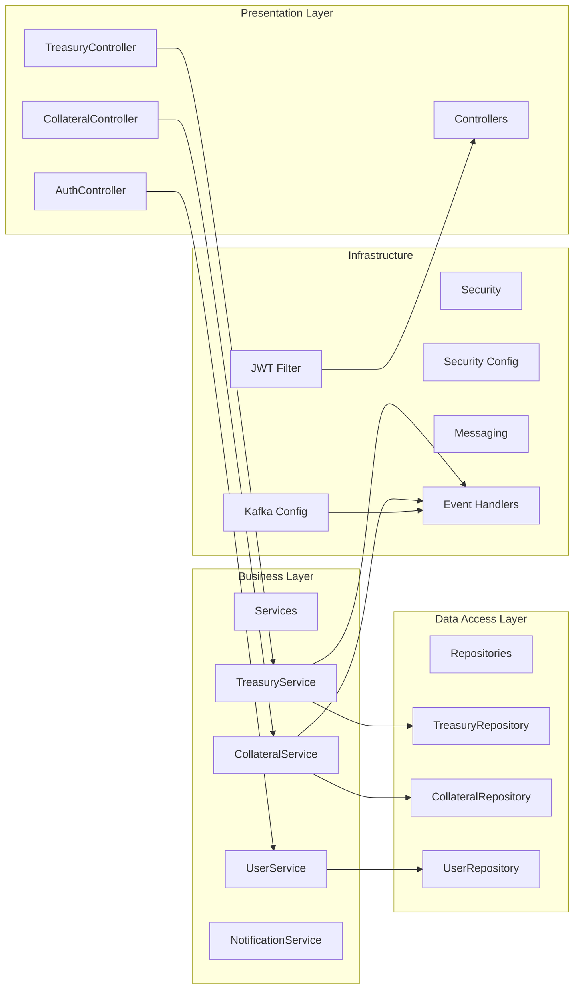
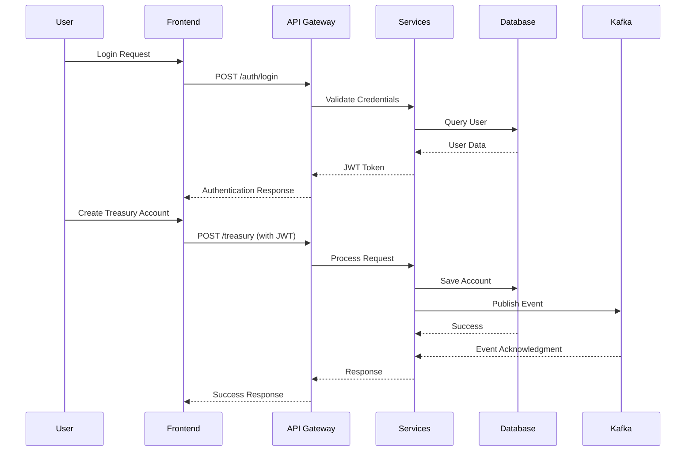

# 🏛️ TCMTreino - Enterprise Treasury & Collateral Management System

[](https://spring.io/projects/spring-boot)
[](https://reactjs.org/)
[](https://openjdk.java.net/projects/jdk/17/)
[](https://mui.com/)
[](https://kafka.apache.org/)
[](https://opensource.org/licenses/MIT)

**A comprehensive financial management platform for Treasury and Collateral operations, built with cutting-edge enterprise technologies.**

[Features](#-key-features) • [Tech Stack](#-technology-stack) • [Architecture](#-system-architecture) • [Quick Start](#-quick-start) • [Documentation](#-documentation)

</div>

---

## 🌟 Key Features

### 💰 Treasury Management
- **Complete CRUD Operations** for treasury accounts with advanced filtering
- **Real-time Dashboard** with live metrics and KPI tracking
- **Risk Analytics** with exposure calculations and limits monitoring
- **Automated Workflows** with approval processes and notifications

### 🛡️ Collateral Management
- **Dynamic Valuation** with real-time pricing and haircut calculations
- **Eligibility Engine** with configurable criteria and compliance rules
- **Margin Monitoring** with automated alerts and threshold management
- **Risk Reporting** with comprehensive exposure analytics

### 🔐 Enterprise Security
- **JWT Authentication** with refresh token rotation
- **Role-based Authorization** (TREASURY, COLLATERAL, ADMIN)
- **API Rate Limiting** and CORS protection
- **Audit Trail** with comprehensive logging

### 🚀 Modern Architecture
- **Event-driven Design** with Apache Kafka messaging
- **Microservices Ready** with modular component structure
- **Real-time Updates** via WebSocket integration
- **Cloud Native** with containerization support

---

## 🛠️ Technology Stack

<table>
<tr>
<td>

### Backend
[](https://spring.io/projects/spring-boot)
[](https://openjdk.java.net/projects/jdk/17/)
[](https://spring.io/projects/spring-security)
[](https://kafka.apache.org/)

</td>
<td>

### Frontend
[](https://reactjs.org/)
[](https://mui.com/)
[](https://www.typescriptlang.org/)
[](https://axios-http.com/)

</td>
</tr>
</table>

### 📚 Documentation & Resources

| Technology | Documentation | Tutorials |
|------------|---------------|-----------|
| **Spring Boot 3** | [Official Docs](https://docs.spring.io/spring-boot/docs/current/reference/htmlsingle/) | [Building REST APIs](https://spring.io/guides/gs/rest-service/) |
| **Spring Security** | [Reference Guide](https://docs.spring.io/spring-security/reference/index.html) | [JWT Authentication](https://spring.io/guides/tutorials/spring-boot-oauth2/) |
| **React 18** | [React Documentation](https://react.dev/) | [React Tutorial](https://react.dev/learn) |
| **Material-UI** | [MUI Documentation](https://mui.com/getting-started/overview/) | [MUI Templates](https://mui.com/store/?utm_source=docs&utm_medium=referral&utm_campaign=templates-store) |
| **Apache Kafka** | [Kafka Documentation](https://kafka.apache.org/documentation/) | [Kafka with Spring Boot](https://spring.io/projects/spring-kafka) |
| **JPA/Hibernate** | [Hibernate ORM](https://hibernate.org/orm/documentation/6.0/) | [Spring Data JPA](https://docs.spring.io/spring-data/jpa/docs/current/reference/html/) |

---

## 🏗️ System Architecture

### High-Level Architecture


### Component Architecture


### Data Flow Diagram


---

## 🚀 Quick Start

### Prerequisites
- **Java 17+** - [Download OpenJDK](https://openjdk.java.net/install/)
- **Node.js 18+** - [Download Node.js](https://nodejs.org/)
- **Maven 3.8+** - [Install Maven](https://maven.apache.org/install.html)
- **Apache Kafka** - [Download Kafka](https://kafka.apache.org/downloads) (Optional for development)

### 🏁 Getting Started with Spring Initializr

#### 1. Create Your Project Base
Visit [start.spring.io](https://start.spring.io/) and configure:

**Project Configuration:**
- **Project:** Maven
- **Language:** Java
- **Spring Boot:** 3.2.0
- **Java:** 17
- **Packaging:** Jar

**Essential Dependencies:**
```
- Spring Web
- Spring Security
- Spring Data JPA
- Spring Boot DevTools
- Spring for Apache Kafka
- Validation
- Spring Boot Actuator
- H2 Database (for development)
- PostgreSQL Driver (for production)
```

#### 2. Clone and Setup
```bash
# Clone the repository
git clone https://github.com/Sen2pi/treasury.git
cd treasury

# Backend setup
cd backend
mvn clean install
mvn spring-boot:run

# Frontend setup (new terminal)
cd frontend
npm install
npm start
```

#### 3. Access the Application
- **Frontend:** http://localhost:3000
- **Backend API:** http://localhost:8080
- **API Documentation:** http://localhost:8080/swagger-ui.html

---

## 📋 Dependency Breakdown & Rationale

### Backend Dependencies

| Dependency | Purpose | Why This Choice |
|------------|---------|-----------------|
| `spring-boot-starter-web` | REST API development | Industry standard for web applications |
| `spring-boot-starter-security` | Authentication & Authorization | Robust security framework with JWT support |
| `spring-boot-starter-data-jpa` | Database abstraction | Simplifies database operations with ORM |
| `spring-kafka` | Event streaming | Handles high-throughput async messaging |
| `spring-boot-starter-validation` | Data validation | Annotation-based validation with Bean Validation |
| `spring-boot-starter-actuator` | Monitoring & Management | Production-ready monitoring endpoints |
| `postgresql` | Database driver | Enterprise-grade relational database |
| `h2` | In-memory database | Fast development and testing |
| `jjwt` | JWT token handling | Secure and lightweight JWT implementation |

### Frontend Dependencies

| Dependency | Purpose | Why This Choice |
|------------|---------|-----------------|
| `react` | UI library | Component-based architecture with large ecosystem |
| `@mui/material` | UI components | Professional, accessible, and customizable components |
| `axios` | HTTP client | Promise-based with interceptors and request/response handling |
| `react-router-dom` | Routing | Declarative routing for single-page applications |
| `@mui/icons-material` | Icons | Consistent iconography matching Material Design |
| `recharts` | Data visualization | Composable charting library built on React components |

### Configuration Examples

**Backend Application Properties:**
```yaml
server:
  port: 8080

spring:
  datasource:
    url: jdbc:h2:mem:treasury
    driver-class-name: org.h2.Driver
  jpa:
    hibernate:
      ddl-auto: create-drop
    show-sql: true
  kafka:
    bootstrap-servers: localhost:9092
    producer:
      key-serializer: org.apache.kafka.common.serialization.StringSerializer
      value-serializer: org.apache.kafka.common.serialization.JsonSerializer

jwt:
  secret: your-secret-key
  expiration: 86400000
```

**Frontend Environment Variables:**
```env
REACT_APP_API_BASE_URL=http://localhost:8080/api
REACT_APP_WEBSOCKET_URL=ws://localhost:8080/ws
```

---

## 🧪 Testing Strategy

### Backend Testing
```bash
# Run all tests
mvn test

# Run with coverage
mvn test jacoco:report

# Integration tests
mvn verify -P integration-tests
```

### Frontend Testing
```bash
# Unit tests
npm test

# E2E tests
npm run test:e2e

# Coverage report
npm run test:coverage
```

---

## 📦 Project Structure

```
treasury/
├── 📁 backend/
│   ├── 📁 src/main/java/com/treasury/
│   │   ├── 📁 controller/          # REST endpoints
│   │   ├── 📁 service/             # Business logic
│   │   ├── 📁 repository/          # Data access
│   │   ├── 📁 entity/              # JPA entities
│   │   ├── 📁 config/              # Configuration classes
│   │   ├── 📁 security/            # Security configuration
│   │   ├── 📁 kafka/               # Messaging components
│   │   └── 📁 dto/                 # Data transfer objects
│   ├── 📁 src/main/resources/
│   │   ├── 📄 application.yml      # App configuration
│   │   └── 📄 data.sql             # Sample data
│   └── 📄 pom.xml                  # Maven dependencies
├── 📁 frontend/
│   ├── 📁 src/
│   │   ├── 📁 components/          # Reusable UI components
│   │   ├── 📁 pages/               # Page components
│   │   ├── 📁 services/            # API communication
│   │   ├── 📁 hooks/               # Custom React hooks
│   │   ├── 📁 context/             # React context providers
│   │   ├── 📁 utils/               # Utility functions
│   │   └── 📁 theme/               # Material-UI theme
│   ├── 📄 package.json             # NPM dependencies
│   └── 📄 .env                     # Environment variables
├── 📁 docs/
│   ├── 📄 API.md                   # API documentation
│   ├── 📄 DEPLOYMENT.md            # Deployment guide
│   └── 📄 CONTRIBUTING.md          # Contribution guidelines
├── 📄 README.md
├── 📄 docker-compose.yml           # Local development setup
└── 📄 .gitignore
```

---

## 🚢 Deployment & Production

### Docker Deployment
```bash
# Build and run with Docker Compose
docker-compose up --build

# Production deployment
docker-compose -f docker-compose.prod.yml up -d
```

### Environment Configuration
```yaml
# Production application.yml
spring:
  profiles:
    active: production
  datasource:
    url: ${DATABASE_URL}
    username: ${DB_USERNAME}
    password: ${DB_PASSWORD}
  kafka:
    bootstrap-servers: ${KAFKA_BROKERS}
```

---

## 🤝 Contributing

We welcome contributions! Please see our [Contributing Guide](CONTRIBUTING.md) for details.

1. Fork the repository
2. Create a feature branch (`git checkout -b feature/amazing-feature`)
3. Commit your changes (`git commit -m 'Add amazing feature'`)
4. Push to the branch (`git push origin feature/amazing-feature`)
5. Open a Pull Request

---

## 📄 License

This project is licensed under the MIT License - see the [LICENSE](LICENSE) file for details.

---

## 🏆 Key Highlights

### ✨ Technical Excellence
- **Modern Java 17** features (sealed classes, pattern matching, records)
- **Spring Boot 3** with native compilation support
- **React 18** with concurrent features and hooks
- **Event-driven architecture** with Apache Kafka

### 🔒 Enterprise Security
- **JWT authentication** with refresh token rotation
- **Role-based access control** with fine-grained permissions
- **API rate limiting** and DDoS protection
- **Comprehensive audit logging**

### 💼 Financial Domain Expertise
- **Treasury management** with risk calculations
- **Collateral valuation** with real-time pricing
- **Regulatory compliance** reporting
- **Risk analytics** and monitoring

### 🌐 Modern Development Practices
- **Clean architecture** with separation of concerns
- **Test-driven development** with high coverage
- **CI/CD ready** with GitHub Actions
- **Cloud-native** deployment strategies

---

<div align="center">

**Built with ❤️ for demonstrating advanced full-stack development capabilities in financial systems**

[](https://linkedin.com/#/k-patatas)
[](https://github.com/Sen2pi)

</div>
