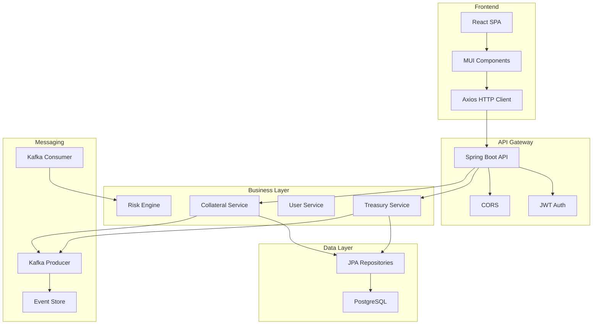

# TCM Treino – Treasury & Collateral Management

[](https://spring.io/projects/spring-boot)
[](https://reactjs.org/)
[](https://kafka.apache.org/)
[](https://www.docker.com/)
[](https://www.postgresql.org/)
[](LICENSE)

> **A modern, enterprise-grade platform for managing Treasury and Collateral operations, built with Spring Boot, React, Kafka, and PostgreSQL.**

---

## Table of Contents
- [Key Features](#key-features)
- [Technology Stack](#technology-stack)
- [System Architecture](#system-architecture)
- [Project Structure](#project-structure)
- [Quick Start Guide](#quick-start-guide)
- [API Overview](#api-overview)
- [Frontend Overview](#frontend-overview)
- [Testing](#testing)
- [Contributing](#contributing)
- [License](#license)

---

## 🚀 Key Features

### 💰 Treasury Management
- Full CRUD for treasury accounts (create, update, delete, view)
- Advanced filtering by status, type, currency, bank
- Fund transfers between accounts with validation
- Real-time balance and available balance tracking
- Low balance alerts and summary reports

### 🛡️ Collateral Management
- Full CRUD for collaterals (bonds, stocks, real estate, etc.)
- Dynamic valuation, haircut calculation, eligibility engine
- Expiry monitoring, risk analytics, and high-risk detection
- Advanced search and reporting (by type, rating, currency, etc.)
- Real-time eligible value and risk exposure calculation

### 👤 User & Security
- JWT authentication with role-based access (ADMIN, TREASURY, COLLATERAL, USER)
- Registration, login, logout, and profile endpoints
- Password encryption (BCrypt)
- User enable/disable, role management, and audit events

### 📊 Analytics & Dashboard
- Modern dashboard with KPIs (total balance, eligible collaterals, etc.)
- Interactive charts (bar, pie) for account and collateral distribution
- Real-time updates via Kafka event-driven architecture

### 🛰️ Event-Driven & Integrations
- Apache Kafka for event streaming (user, treasury, collateral, audit, notification)
- Microservices-ready modular backend
- RESTful API with CORS and rate limiting
- Docker Compose for local development (PostgreSQL, Kafka, Zookeeper)

---

## 🛠️ Technology Stack

### Backend
- **Spring Boot 3.2+** ([Docs](https://docs.spring.io/spring-boot/docs/current/reference/htmlsingle/))
- **Spring Security** ([Docs](https://docs.spring.io/spring-security/reference/))
- **Spring Data JPA** ([Docs](https://docs.spring.io/spring-data/jpa/docs/current/reference/html/))
- **Apache Kafka** ([Docs](https://kafka.apache.org/documentation/))
- **JWT (jjwt)** ([Docs](https://github.com/jwtk/jjwt))
- **PostgreSQL** ([Docs](https://www.postgresql.org/docs/))
- **H2 Database** (for dev/testing)
- **Lombok** ([Docs](https://projectlombok.org/))

### Frontend
- **React 18+** ([Docs](https://react.dev/))
- **Material-UI (MUI) 5+** ([Docs](https://mui.com/getting-started/overview/))
- **Axios** ([Docs](https://axios-http.com/))
- **React Router v6** ([Docs](https://reactrouter.com/en/main))
- **Recharts** ([Docs](https://recharts.org/en-US/))
- **Framer Motion** ([Docs](https://www.framer.com/motion/))

### DevOps & Tooling
- **Docker Compose** ([Docs](https://docs.docker.com/compose/))
- **Maven** ([Docs](https://maven.apache.org/guides/))
- **Node.js 18+** ([Docs](https://nodejs.org/en/docs))

---

## 🏗️ System Architecture



---

## 📦 Project Structure

```
TCMTreino/
├── backend/           # Spring Boot API (Java)
│   ├── src/main/java/com/treasury/kpstreasury/
│   │   ├── controllers/   # REST endpoints
│   │   ├── services/      # Business logic
│   │   ├── repositories/  # Data access
│   │   ├── models/        # Entities & DTOs
│   │   ├── config/        # Security, Kafka, JWT
│   │   ├── events/        # Kafka event models
│   │   └── utils/         # Mappers
│   ├── src/main/resources/
│   │   └── application.properties
│   └── pom.xml
├── frontend/          # React SPA (JS)
│   ├── src/
│   │   ├── components/    # UI components
│   │   ├── pages/         # Main pages (Dashboard, Treasury, Collateral, Auth)
│   │   ├── services/      # API clients
│   │   ├── contexts/      # Auth context
│   │   └── theme/         # MUI theme
│   └── package.json
├── docker-compose.yml # Local dev stack (Kafka, Postgres)
└── README.md
```

---

## ⚡ Quick Start Guide

### Prerequisites
- [Docker & Docker Compose](https://docs.docker.com/get-docker/)
- [Node.js 18+](https://nodejs.org/)
- [Java 17+](https://adoptium.net/)
- [Maven 3.8+](https://maven.apache.org/)

### 1. Start Infrastructure (Kafka, Postgres)
```bash
docker-compose up -d
```

### 2. Start Backend (Spring Boot)
```bash
cd backend
mvn clean install
mvn spring-boot:run
```

- API: http://localhost:8080/api
- Swagger UI: http://localhost:8080/swagger-ui.html *(if enabled)*

### 3. Start Frontend (React)
```bash
cd frontend
npm install
npm start
```
- App: http://localhost:3000

---

## 🛡️ API Overview

### Authentication
- `POST /api/auth/login` – User login (JWT)
- `POST /api/auth/register` – User registration
- `POST /api/auth/logout` – Logout
- `GET /api/auth/me` – Get current user
- `GET /api/auth/validate-token` – Validate JWT

### Treasury
- `GET /api/treasury` – List all accounts
- `POST /api/treasury` – Create account
- `PUT /api/treasury/{id}` – Update account
- `DELETE /api/treasury/{id}` – Delete account
- `POST /api/treasury/transfer` – Transfer funds
- `GET /api/treasury/reports/total-balance` – Total balance by currency/status
- ...and more (see code/docs)

### Collateral
- `GET /api/collateral` – List all collaterals
- `POST /api/collateral` – Create collateral
- `PUT /api/collateral/{id}` – Update collateral
- `DELETE /api/collateral/{id}` – Delete collateral
- `GET /api/collateral/reports/total-eligible-value` – Total eligible value
- ...and more (see code/docs)

### Users
- `GET /api/users` – List users (admin)
- `PUT /api/users/{id}` – Update user
- `PUT /api/users/{id}/change-password` – Change password
- ...and more

> **Full API details:** See [Spring Boot Controller code](./backend/src/main/java/com/treasury/kpstreasury/controllers/) or Swagger UI if enabled.

---

## 🖥️ Frontend Overview

- **Login/Register:** Secure authentication, registration, and JWT session management
- **Dashboard:** KPIs, charts, and quick stats for treasury and collateral
- **Treasury:** Manage accounts, transfer funds, view balances, filter/search
- **Collateral:** Manage collaterals, eligibility, risk, and reporting
- **Responsive UI:** Modern Material-UI design, dark/light mode, animated transitions

---

## 🧪 Testing

### Backend
```bash
cd backend
mvn test
```

### Frontend
```bash
cd frontend
npm test
```

---

## 🤝 Contributing

We welcome contributions! Please fork the repo, create a feature branch, and submit a pull request.

---

## 📄 License

This project is licensed under the MIT License. See [LICENSE](LICENSE) for details.

---

**Built with passion for modern financial systems.**
